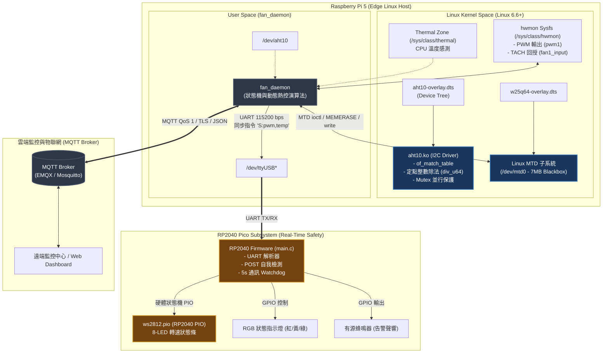

# 智慧機架溫控與 MTD 快閃黑盒子遙測系統 (Edge Thermal & MTD Blackbox)

[](LICENSE)
[](https://www.raspberrypi.com/)
[-green.svg)](https://kernel.org/)
[]()
[]()
[-blue.svg?logo=adobeacrobatreader)](docs/專題簡報-機櫃溫度環控模組.pdf)
[](https://youtu.be/Q1XI1jcykzs)

一個專為伺服器機架、工業邊緣運算節點（Edge Computing Node）設計的**高可靠度異質雙晶片（Heterogeneous Dual-Core）熱管理與斷線快閃黑盒子遙測系統**。

本系統結合了 **Raspberry Pi 5 (Linux Kernel + User-space Daemon)** 與 **RP2040 (Real-Time PIO State Machine)**，實現了從底層 Linux 核心驅動、工業級 MTD 斷線快照重放，到微秒級硬體狀態機告警的完整垂直整合架構。

> 📌 **快速導覽與實機展示**：
> - 📄 **[點此線上預覽完整專案簡報 (PDF)](docs/專題簡報-機櫃溫度環控模組.pdf)**（涵蓋架構、Kernel 裁減數據、Root Cause 分析與邏輯分析儀波形）
> - 🎥 **[實作硬體運作 DEMO 影片 (YouTube)](https://youtu.be/Q1XI1jcykzs)**
> - 🌐 **[MQTT 雙向通訊連線終端機畫面 (YouTube)](https://youtu.be/MVUiem5-Jno)**
> - 💾 **[斷線黑盒子儲存與復網回放終端機畫面 (YouTube)](https://youtu.be/BRNewQzBiq8)**

---

## 📑 目錄

- [一、 實機展示與 Demo 影片 (Live Demo)](#一-實機展示與-demo-影片-live-demo)
- [二、 專案技術簡報 (Presentation Slides)](#二-專案技術簡報-presentation-slides)
- [三、 系統架構圖](#三-系統架構圖)
- [四、 核心工程亮點與技術實現](#四-核心工程亮點與技術實現)
  - [1. Linux Kernel I2C 驅動模組與設備樹](#1-linux-kernel-i2c-驅動模組與設備樹)
  - [2. MTD 原始設備斷線黑盒子儲存與重放 (Store-and-Forward)](#2-mtd-原始設備斷線黑盒子儲存與重放-store-and-forward)
  - [3. 工業級風扇轉速回授與防堵轉保護 (Stall Detection)](#3-工業級風扇轉速回授與防堵轉保護-stall-detection)
  - [4. RP2040 PIO 精準時序控制與 Watchdog 保護](#4-rp2040-pio-精準時序控制與-watchdog-保護)
- [五、 硬體清單與接線對照表 (Pinout)](#五-硬體清單與接線對照表-pinout)
- [六、 專案目錄結構](#六-專案目錄結構)
- [七、 編譯與部署指南](#七-編譯與部署指南)
  - [1. Device Tree Overlay 編譯與掛載](#1-device-tree-overlay-編譯與掛載)
  - [2. Linux 核心驅動編譯與載入](#2-linux-核心驅動編譯與載入)
  - [3. 使用者空間守護行程 (Daemon) 編譯與啟動](#3-使用者空間守護行程-daemon-編譯與啟動)
  - [4. RP2040 Pico 韌體編譯與燒錄](#4-rp2040-pico-韌體編譯與燒錄)
- [八、 MQTT 通訊協定與 JSON Payload 規範](#八-mqtt-通訊協定與-json-payload-規範)
- [九、 授權條款 (License)](#九-授權條款-license)

---

## 一、 實機展示與 Demo 影片 (Live Demo)

本專案提供完整之實體硬體運作與上位機雙向連線測試影片，點擊下方預覽圖即可直接於 YouTube 觀看實機動態展示：

| 實作硬體運作 DEMO | MQTT 雙向通訊正常連線 | 斷線黑盒子寫入與復網回放 |
| :---: | :---: | :---: |
| [](https://youtu.be/Q1XI1jcykzs) | [](https://youtu.be/MVUiem5-Jno) | [](https://youtu.be/BRNewQzBiq8) |
| **[▶️ 觀看實機動態展示](https://youtu.be/Q1XI1jcykzs)**<br>涵蓋 AHT10 感測、PWM 動態調速、WS2812B 燈條與聲光告警 | **[▶️ 觀看雙向通訊畫面](https://youtu.be/MVUiem5-Jno)**<br>左：溫控 RPi5 終端機<br>右：中控台伺服器終端機 | **[▶️ 觀看黑盒子回傳畫面](https://youtu.be/BRNewQzBiq8)**<br>離線時 W25Q64 Flash 暫存<br>復聯後批次回放至 MQTT Broker |

---

## 二、 專案技術簡報 (Presentation Slides)

完整專題技術簡報（PDF）已收錄於本專案目錄中：👉 **[專題簡報-機櫃溫度環控模組.pdf](docs/專題簡報-機櫃溫度環控模組.pdf)**

### 📑 簡報重點摘要
1. **系統架構與工作流程圖**：分層解耦 Linux 主機與 RP2040 即時安全協同運作機制。
2. **技術清單與門檻對照表**：環境溫/CPU 雙重溫度 MAX Policy 與風扇 PWM / WS2812B 燈條 / LED / 蜂鳴器聯動邏輯。
3. **Kernel 裁減優化成果**：針對 Debian Trixie (rpi-6.18.y) 移除多餘子系統，映像檔體積縮減 18.4%，開機耗時自 2.5s 縮短至 938ms (加速 63%)。
4. **5 大工程難題與 Root Cause 分析**：包含 SPI 降頻避開電源爬升時序不穩、Flash 抹除校驗、stdio 搶佔 UART0 中斷、newlib-nano 浮點數輕量解析、風扇慣性啟動緩衝期 (spinup_grace)。
5. **邏輯分析儀實測驗證**：PulseView 擷取 AHT10 I2C 20-bit 溫濕度原始資料及 RP2040 PIO 800kHz NZR 奈秒時序訊號。

---

## 三、 系統架構圖

本系統採用分層解耦的異質架構，將「重度運算與網路傳輸」交給 Linux 主機，而將「硬體時序控制與安全告警」下放給即時微控制器：



---

## 四、 核心工程亮點與技術實現

### 1. Linux Kernel I2C 驅動模組與設備樹
- **核心空間規範 (Kernel Space Integrity)**：在核心驅動（`driver/aht10.c`）中嚴格禁用浮點運算，使用 64 位元定點整數除法（`div_u64`）換算溫濕度，防止污染 FPU 暫存器。
- **Device Tree 動態匹配**：撰寫 `dts/aht10-overlay.dts`，支援透過 `topsoft,aht10` 節點觸發 I2C Probe，並自動於 `/dev/aht10` 生成字元設備節點。
- **重試與防併發**：透過 `mutex_lock` 保障多行程讀取設備節點時的 I2C 匯流排安全，並內建 busy bit 重試等待機制。

### 2. MTD 原始設備斷線黑盒子儲存與重放 (Store-and-Forward)
在工業環境中，網路隨時可能因電磁干擾或路由器重啟而中斷。本專案透過外部 SPI NOR Flash 實現斷線快照黑盒子：
- **原始磁區對齊操作**：直接對 `/dev/mtd0` 進行底層 `ioctl(MEMERASE)` 4KB Sector 對齊抹除，並以 `O_SYNC` 模式直寫晶片。
- **高效能二進位序列化**：自定義 16-Byte `blackbox_entry_t`（`__attribute__((packed))`），儲存 Unix Timestamp、環境溫濕度與風扇負載。
- **自動批次回放 (Batch Replay)**：網路恢復上線後，守護行程以 `FLUSH_BATCH_SIZE=50` 筆為單位批次回放歷史封包至 MQTT Broker，並標註 `"replayed": true`，最後自動抹除已回放扇區重置緩衝區。

### 3. 工業級風扇轉速回授與防堵轉保護 (Stall Detection)
- **硬體雙溫控動態曲線**：綜合評估內部 CPU Die 核心溫度與外部 AHT10 機架環境進氣溫度，自動決定最合適的 PWM 轉速輸出。
- **風扇啟動寬限期 (Spin-up Grace Period)**：針對無刷風扇啟動時慣性加速的物理特性，設計了 3 秒的 `spinup_grace` 寬限計時器，杜絕風扇剛加速時因 TACH 為 0 產生的誤告警。
- **硬體轉速反饋防護**：連續 2 週期（2 秒）檢測到 PWM 驅動但實體轉速 RPM 為 0 時，立即判定為風扇軸承堵轉（`FAN_STALL`），通報 MQTT 並驅動次級控制器蜂鳴器報警。

### 4. RP2040 PIO 精準時序控制與 Watchdog 保護
- **硬體狀態機卸載**：WS2812B RGB LED 擁有極其嚴格的微秒級（800kHz）時脈協定。透過 RP2040 的 Programmable I/O（`ws2812.pio`），純硬體狀態機執行時序發送，完全不消耗 CPU 週期，亦不受中斷干擾。
- **通訊超時看門狗 (Watchdog Protection)**：當上位機 Linux 主機當機或 UART 連線脫落超過 5 秒，Pico 韌體自動觸發超時保護機制，強制熄滅所有指示燈與蜂鳴器，防止警報失控長鳴。
- **POST (Power-On Self-Test)**：通電時依序自動點亮三色 LED、掃描跑馬燈並觸發短音蜂鳴，確保周邊硬體在投入運作前功能完好。

---

## 五、 硬體清單與接線對照表 (Pinout)

### 1. 主要元件清單 (BOM)
1. **主控制器**：Raspberry Pi 5 (4GB / 8GB)
2. **輔助安全控制器**：Raspberry Pi Pico / Pico W (RP2040)
3. **環境溫濕度感測器**：AHT10 (I2C 介面)
4. **SPI NOR Flash**：Winbond W25Q64FV (8MB / 64M-bit)
5. **可定址 RGB 燈條**：WS2812B 8-Pixel LED Strip
6. **狀態指示燈與蜂鳴器**：紅/黃/綠 5mm LED 各一、有源蜂鳴器模組
7. **散熱風扇**：支援 PWM 控制與 TACH 轉速回授之 4-Wire 散熱風扇

---

### 2. 接線配置表

#### A. Raspberry Pi 5 腳位連接
| 周邊裝置 | 裝置腳位 | 樹莓派 5 實體 Pin | 訊號定義 / 備註 |
| :--- | :--- | :--- | :--- |
| **AHT10** | VCC / GND | Pin 1 (3.3V) / Pin 9 (GND) | 供電 |
| **AHT10** | SDA / SCL | Pin 3 (GPIO2) / Pin 5 (GPIO3) | I2C1 匯流排 |
| **W25Q64** | VCC / GND | Pin 17 (3.3V) / Pin 25 (GND) | 供電 |
| **W25Q64** | CS / CLK | Pin 24 (GPIO8) / Pin 23 (GPIO11) | SPI0 CE0 / SCLK |
| **W25Q64** | MOSI / MISO | Pin 19 (GPIO10) / Pin 21 (GPIO9) | SPI0 MOSI / MISO |
| **4-Wire Fan** | PWM / TACH | 原廠專用風扇插座 或 GPIO | 透過 `hwmon` 節點驅動 |
| **USB-UART** | TX / RX | 連接至 Pico 的 RX / TX | 115200-8N1 |

#### B. Raspberry Pi Pico (RP2040) 腳位連接
| 周邊裝置 | Pico GPIO | Pico 實體 Pin | 功能說明 |
| :--- | :--- | :--- | :--- |
| **UART0 RX** | GPIO 1 | Pin 2 | 接收樹莓派控制指令 |
| **UART0 TX** | GPIO 0 | Pin 1 | 回傳狀態（預留） |
| **WS2812B DIN**| GPIO 22 | Pin 29 | PIO0 驅動 8 顆 RGB LED 轉速條 |
| **綠色 LED** | GPIO 15 | Pin 20 | 正常工作 / 低溫指示燈 |
| **黃色 LED** | GPIO 14 | Pin 19 | 中溫警戒指示燈 |
| **紅色 LED** | GPIO 13 | Pin 17 | 高溫 / 警報指示燈 |
| **有源蜂鳴器** | GPIO 20 | Pin 26 | 故障 / 堵轉警報聲響 |

---

## 六、 專案目錄結構

```text
├── .gitignore                    # Git 忽略中間編譯產物
├── LICENSE                       # GNU GPL v2.0 授權條款
├── README.md                     # 專案詳細架構與操作文件
├── docs/                         # 專案文件與展示簡報
│   └── 專題簡報-機櫃溫度環控模組.pdf # 完整專案架構、Kernel優化與儀器驗證簡報
├── dts/                          # 設備樹原始碼與編譯檔
│   ├── aht10-overlay.dts         # AHT10 I2C 設備樹覆蓋層
│   ├── w25q64-overlay.dts        # W25Q64 SPI-NOR MTD 設備樹覆蓋層
│   └── Makefile                  # dtc 自動化編譯與安裝腳本
├── driver/                       # Linux 核心驅動模組
│   ├── aht10.c                   # AHT10 字元設備核心驅動
│   └── Makefile                  # Kbuild 核心模組編譯腳本
├── daemon/                       # 使用者空間熱管與黑盒子服務
│   ├── fan_daemon.c              # 主守護行程 (MQTT / MTD / UART / Thermal)
│   ├── mqtt_config.txt.example   # MQTT Broker 連線設定範本
│   └── Makefile                  # gcc 編譯腳本 (鏈結 mosquitto, cjson, m)
└── firmware_pico/                # RP2040 燈效告警韌體
    ├── CMakeLists.txt            # Pico C/C++ SDK CMake 建置檔
    ├── pico_sdk_import.cmake     # Pico SDK 導引檔
    ├── main.c                    # Pico 主控制邏輯與 Watchdog
    └── ws2812.pio                # RP2040 PIO 精密狀態機彙編原始碼
```

---

## 七、 編譯與部署指南

### 1. Device Tree Overlay 編譯與掛載
在 Raspberry Pi 5 終端機執行：
```bash
cd dts
make
sudo make install
```
接著編輯 `/boot/firmware/config.txt`，在檔尾加入：
```ini
dtoverlay=aht10-overlay
dtoverlay=w25q64-overlay
```
重新開機使設備樹生效：
```bash
sudo reboot
```
開機後檢查節點是否建立：
```bash
ls -l /dev/aht10 /dev/mtd*
```

---

### 2. Linux 核心驅動編譯與載入
確保已安裝樹莓派核心標頭檔：
```bash
sudo apt update
sudo apt install -y raspberrypi-kernel-headers build-essential
```
編譯驅動並載入核心：
```bash
cd driver
make
sudo insmod aht10.ko
```
確認核心模組運作狀況：
```bash
dmesg | grep aht10
```

---

### 3. 使用者空間守護行程 (Daemon) 編譯與啟動
安裝相依通訊與 JSON 解析函式庫：
```bash
sudo apt install -y libmosquitto-dev libcjson-dev
```
設定 MQTT Broker 位址並編譯：
```bash
cd daemon
cp mqtt_config.txt.example mqtt_config.txt
# 編輯 mqtt_config.txt 輸入你的 MQTT Broker IP
nano mqtt_config.txt

make
sudo ./fan_daemon
```

#### (選配) 註冊為 Systemd 系統服務常駐執行
建立服務檔 `/etc/systemd/system/fan_daemon.service`：
```ini
[Unit]
Description=Edge Thermal Management and Blackbox Daemon
After=network.target

[Service]
Type=simple
User=root
WorkingDirectory=/home/pi/daemon
ExecStart=/usr/local/bin/fan_daemon
Restart=always
RestartSec=5

[Install]
WantedBy=multi-user.target
```
啟用服務：
```bash
sudo systemctl daemon-reload
sudo systemctl enable --now fan_daemon
```

---

### 4. RP2040 Pico 韌體編譯與燒錄
需先在開發電腦上配置好 [Raspberry Pi Pico SDK](https://github.com/raspberrypi/pico-sdk)。
```bash
cd firmware_pico
mkdir build && cd build
cmake ..
make -j4
```
將生成的 `thermal_pico_firmware.uf2` 拖曳至處於 BOOTSEL 模式的 Raspberry Pi Pico 即完成燒錄。

---

## 八、 MQTT 通訊協定與 JSON Payload 規範

系統支援全雙工遠端遙控與資料串流監控：

### 1. 連線心跳與在線狀態 (`rack/thermal/report-in`)
- **QoS**: 1 (Retained: `true`)
```json
{
  "online": true
}
```

### 2. 即時遙測數據 (`rack/thermal/telemetry`)
- **QoS**: 0 (即時遙測)
- **歷史重放標籤**：若該筆資料來自 Flash 黑盒子，將附加 `"replayed": true`。
```json
{
  "timestamp": 1726410500,
  "temp": 28.4,
  "hum": 62.5,
  "fan_speed_pct": 60,
  "fan_rpm": 2700,
  "replayed": false
}
```

### 3. 系統狀態與告警通報 (`rack/thermal/state`)
- **QoS**: 1 (Retained: `true`)
- **告警代碼**：`NONE`（正常）、`FAN_STALL`（風扇堵轉）、`SENSOR_ERROR`（感測器異常）、`HIGH_TEMP`（超溫警報）。
```json
{
  "timestamp": 1726410500,
  "mode": "AUTO",
  "alarm": true,
  "alarm_code": "FAN_STALL",
  "temp_threshold": 40.0
}
```

### 4. 下行控制指令 (`rack/thermal/cmd`)
- **控制模式切換與手動轉速設定**：
```json
{
  "mode": "MANUAL",
  "fan_speed_pct": 80
}
```
- **警報觸發門檻值調整**：
```json
{
  "temp_threshold": 45.0
}
```

---

## 九、 授權條款 (License)

本專案之 Linux 核心模組與整體原始碼採用 [GNU General Public License v2.0 (GPL-2.0)](LICENSE) 授權發布。
