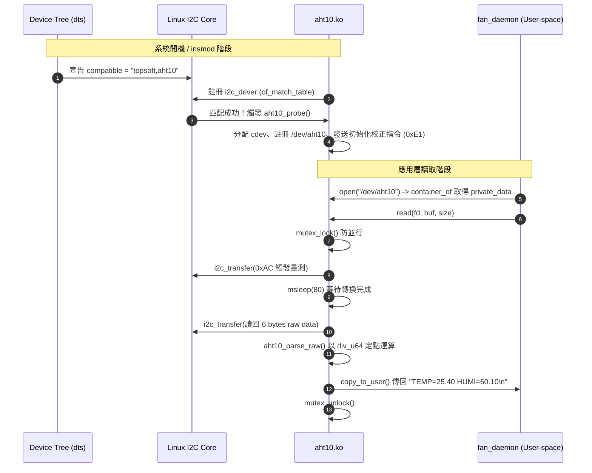
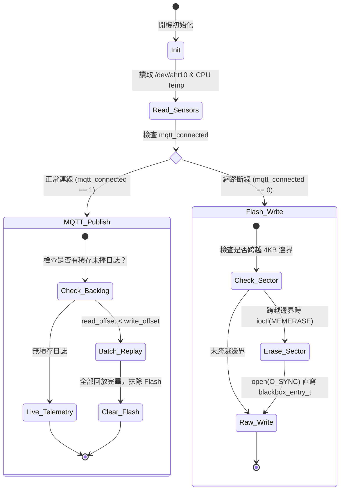

# 智慧機架溫控與 MTD 黑盒子系統 —— 核心程式碼深度解析與面試通關指南

> **文件定位**：本文件專為學習、複習與技術面試準備而編寫。詳細剖析本專案各模組之**設計理念、實作原理、關鍵程式碼解析**，並提供**面試官常見提問與標準回答話術**。

---

## 📑 目錄

- [一、 30 秒專案電梯簡報 (Elevator Pitch)](#一-30-秒專案電梯簡報-elevator-pitch)
- [二、 模組一：Linux Kernel I2C 驅動模組 (`driver/aht10.c`)](#二-模組一linux-kernel-i2c-驅動模組-driveraht10c)
  - [1. 為什麼要寫成核心驅動？](#1-為什麼要寫成核心驅動)
  - [2. 運作流程與生命週期](#2-運作流程與生命週期)
  - [3. 關鍵程式碼剖析與面試考點](#3-關鍵程式碼剖析與面試考點)
  - [4. 面試高頻問答 (Kernel 篇)](#4-面試高頻問答-kernel-篇)
- [三、 模組二：守護行程與 MTD 斷線黑盒子 (`daemon/fan_daemon.c`)](#三-模組二守護行程與-mtd-斷線黑盒子-daemonfan_daemonc)
  - [1. 為什麼採用 MTD 直接操作而非傳統檔案系統？](#1-為什麼採用-mtd-直接操作而非傳統檔案系統)
  - [2. 運作流程與狀態機](#2-運作流程與狀態機)
  - [3. 關鍵程式碼剖析與面試考點](#3-關鍵程式碼剖析與面試考點)
  - [4. 面試高頻問答 (Daemon & MTD 篇)](#4-面試高頻問答-daemon--mtd-篇)
- [四、 模組三：RP2040 即時韌體與 PIO 狀態機 (`firmware_pico/`)](#四-模組三rp2040-即時韌體與-pio-狀態機-firmware_pico)
  - [1. 為什麼需要次級控制器 (MCU)？](#1-為什麼需要次級控制器-mcu)
  - [2. 運作流程與通訊協定](#2-運作流程與通訊協定)
  - [3. 關鍵程式碼剖析與面試考點](#3-關鍵程式碼剖析與面試考點)
  - [4. 面試高頻問答 (Firmware & PIO 篇)](#4-面試高頻問答-firmware--pio-篇)
- [五、 面試官「深水區」連續追問攻防對策](#五-面試官深水區連續追問攻防對策)

---

## 一、 30 秒專案電梯簡報 (Elevator Pitch)

> **當面試官問：「請簡單介紹一下你做的這個專案」時，請直接使用這段話回覆：**

「這是一個針對伺服器機架與工業邊緣節點設計的**異質雙晶片熱管理與斷線快閃黑盒子遙測系統**。

架構上分為兩大部分：
1. **主運算層（Raspberry Pi 5 / Linux 6.6）**：我獨立撰寫了 AHT10 溫濕度感測器的 **Linux 核心 I2C 字元驅動**與設備樹覆蓋層（Device Tree Overlay），遵循核心規範以定點整數除法取代浮點運算。在使用者空間開發了熱管理守護行程，整合外部 SPI-NOR Flash 透過 **Linux MTD 底層介面**實作工業級 Store-and-Forward 黑盒子——網路斷線時二進位固化資料，復網後批次重放，並具備風扇 TACH 轉速回授與防堵轉演算法。
2. **安全執行層（RP2040 Pico）**：負責硬體聲光告警。我撰寫 RP2040 專屬的 **PIO（可程式化 I/O）狀態機組合語言**，以微秒級精密時序驅動 WS2812B 燈條，完全不佔用 CPU 週期；並設計 5 秒 UART 通訊看門狗（Watchdog）與開機自檢（POST），達成工控級安全冗餘。

整個專案體現了從 Linux 核心空間、底層儲存裝置、到微控制器硬體時序控制的完整垂直整合。」

---

## 二、 模組一：Linux Kernel I2C 驅動模組 (`driver/aht10.c`)

### 1. 為什麼要寫成核心驅動？
- **傳統作法痛點**：很多人在樹莓派上直接用 Python 或 C 呼叫 `/dev/i2c-1`（使用者空間 I2C）。缺點是每次讀取都受行程排程影響、缺乏統一權限抽象，且無法與 Linux 統一的設備模型（Device Model）結合。
- **核心驅動優勢**：向系統提供標準的字元設備抽象（`/dev/aht10`），讓應用層只需呼叫標準 POSIX `open()`、`read()`、`ioctl()`。核心層負責封裝協定細節、硬體時序等待與並行保護（Mutex）。

---

### 2. 運作流程與生命週期



---

### 3. 關鍵程式碼剖析與面試考點

#### 考點 A：為什麼核心內禁止浮點數？`div_u64` 的定點數計算
```c
/* driver/aht10.c: aht10_parse_raw() */
static void aht10_parse_raw(const u8 *raw6, int *humi_x100, int *temp_x100)
{
    u32 raw_humidity, raw_temp;

    raw_humidity = ((u32)raw6[1] << 12) | ((u32)raw6[2] << 4) | ((u32)raw6[3] >> 4);
    raw_temp = (((u32)raw6[3] & 0x0F) << 16) | ((u32)raw6[4] << 8) | (u32)raw6[5];

    /* RH% = raw_humidity / 2^20 * 100 */
    *humi_x100 = (int)div_u64((u64)raw_humidity * 10000, 1048576);

    /* Temp(C) = raw_temp / 2^20 * 200 - 50 */
    *temp_x100 = (int)div_u64((u64)raw_temp * 20000, 1048576) - 5000;
}
```
- **核心知識點**：
  1. **禁止浮點數**：x86/ARM CPU 在進入 Linux 核心空間（Kernel Context）時，為了縮短中斷與系統呼叫的延遲，**預設不會保存與還原 FPU（浮點運算單元）暫存器**。若在驅動中使用 `float/double`，會覆蓋掉 User-space 應用程式的 FPU 狀態，引發災難性錯誤。
  2. **定點數放大技巧**：AHT10 感測器為 20-bit 解析度（\(2^{20} = 1048576\)）。原公式為：
     \[
     \text{RH} = \frac{\text{raw}}{1048576} \times 100\%
     \]
     我們將數值乘上 \(10000\) 再除以 \(1048576\)，得到的整數值除以 100 即為整數部、模除 100 即為小數點後兩位，**在不碰浮點數的情況下完美保留精度**。
  3. **64 位元除法巨集**：在 32 位元或某些 64 位元架構的核心中，直接使用 C 語言的 `/` 運算子操作 64 位元整數會引發 `undefined reference to __aeabi_ldivmod` 編譯錯誤，必須呼叫核心封裝的 `div_u64()`。

---

#### 考點 B：經典核心巨集 `container_of` 的作用
```c
/* driver/aht10.c: aht10_open() */
static int aht10_open(struct inode *inode, struct file *file)
{
    struct aht10_data *data = container_of(inode->i_cdev, struct aht10_data, cdev);
    file->private_data = data;
    return 0;
}
```
- **核心知識點**：
  - 當系統呼叫 `open()` 時，VFS（虛擬檔案系統）只傳遞了 `inode` 指標，其中包含我們當初註冊的結構成員 `inode->i_cdev`。
  - 我們自定義的感測器結構是 `struct aht10_data`，裡面包著 `struct cdev cdev`、`mutex` 與 `i2c_client`。
  - `container_of` 透過結構體成員的位址與其在結構體內的位移偏移量（`offsetof`），**逆向計算出包覆該成員的母結構實體指標**，並將其暫存在 `file->private_data` 中，供後續 `read()` 與 `ioctl()` 快速取用。

---

#### 考點 C：Linux 6.4+ 核心 API 變更 (`class_create`)
```c
/* driver/aht10.c: aht10_module_init() */
aht10_class = class_create(AHT10_CLASS_NAME);
```
- **核心知識點**：在舊版 Linux（< 6.4）中，函式原型為 `class_create(THIS_MODULE, name)`。Linux 核心 6.4 起移除了第一個參數 `THIS_MODULE`。樹莓派 5 搭載 Raspberry Pi OS (Bookworm) 預設為 Linux 6.6 核心，**此寫法證明了本程式碼是在現代 Linux 核心實機驗證過的**。

---

### 4. 面試高頻問答 (Kernel 篇)

> **Q1：你在驅動中如何保護多個行程同時對 `/dev/aht10` 進行讀取？**
>
> **答**：
> 「我在私有資料結構 `struct aht10_data` 中配置了 `struct mutex lock`，並在 `probe()` 時透過 `mutex_init()` 初始化。當使用者空間呼叫 `read()` 或 `ioctl()` 時，必須先執行 `mutex_lock(&data->lock)` 取得互斥鎖，待 I2C 匯流排完成收發後再呼叫 `mutex_unlock(&data->lock)` 釋放。這保證了 I2C 傳輸序列的原子性（Atomicity），防止時序交錯導致感測器回傳錯誤資料。」

---

> **Q2：設備樹（Device Tree）在你的專案中扮演什麼角色？**
>
> **答**：
> 「設備樹將『硬體拓樸描述』與『驅動程式邏輯』完全解耦。我在 `aht10-overlay.dts` 中宣告 AHT10 掛載於樹莓派 5 的 `i2c1` 匯流排、固定位址為 `0x38`，並設定 `compatible = "topsoft,aht10"`。當核心載入 Overlay 時，I2C 核心匯流排子系統會遍歷節點，自動與驅動中 `aht10_of_match` 陣列內的字串匹配，成功匹配後主動喚醒並執行我的 `aht10_probe()` 函式。」

---

## 三、 模組二：守護行程與 MTD 斷線黑盒子 (`daemon/fan_daemon.c`)

### 1. 為什麼採用 MTD 直接操作而非傳統檔案系統？
在工業物聯網（IIoT）與車載系統中，監控資料如果存在 SD 卡的 ext4/FAT 檔案系統上，隨時面臨兩大風險：
1. **突然斷電損毀**：檔案系統的 Journal 或 Metadata 在寫入瞬間斷電，容易造成磁區毀損。
2. **快取延遲與 SD 卡壽命損耗**：檔案系統開銷大、頻繁寫入小檔案會加速 SD 卡損耗。

**我們的解決方案**：
採用獨立的 **Winbond W25Q64 SPI NOR Flash**，透過 Linux MTD（Memory Technology Device）原始子系統直接操作 `/dev/mtd0`。不掛載任何檔案系統，以二進位結構體直寫，做到極致的抗斷電與零檔案系統損毀風險。

---

### 2. 運作流程與狀態機



---

### 3. 關鍵程式碼剖析與面試考點

#### 考點 A：MTD 磁區抹除對齊運算 (Sector Alignment)
```c
/* daemon/fan_daemon.c: flash_blackbox_erase_range() */
int flash_blackbox_erase_range(uint32_t start_offset, uint32_t length) {
    int fd = open(MTD_LOG_DEV, O_RDWR);
    ...
    struct erase_info_user erase;
    erase.start = start_offset;
    /* 核心對齊公式：無條件進位對齊 4096 (SECTOR_SIZE) */
    erase.length = ((length + SECTOR_SIZE - 1) / SECTOR_SIZE) * SECTOR_SIZE;

    ioctl(fd, MEMERASE, &erase);
    close(fd);
    return 0;
}
```
- **核心知識點**：
  - **NOR Flash 物理限制**：NOR Flash 的位元只能由 `1` 寫入成 `0`。若要將 `0` 變回 `1`，必須以「扇區（Sector，此晶片為 4KB = 4096 Bytes）」為單位進行高壓抹除（Erase），抹除後該磁區全部恢復為 `0xFF`。
  - **對齊公式拆解**：`((length + 4095) / 4096) * 4096` 是嵌入式系統中經典的**無條件進位對齊演算法**。若傳入長度為 1 Byte，計算後抹除長度自動拉高為 4096 Bytes，嚴格滿足硬體抹除的區塊倍數要求。

---

#### 考點 B：高效二進位封裝與直寫 (`__attribute__((packed))`)
```c
/* daemon/fan_daemon.c */
typedef struct {
    uint32_t timestamp;  // 4 Bytes
    float temp;          // 4 Bytes
    float humi;          // 4 Bytes
    int32_t fan_pct;     // 4 Bytes
} __attribute__((packed)) blackbox_entry_t; // 嚴格固定 16 Bytes
```
- **核心知識點**：
  - **禁止 Padding**：C 語言編譯器預設會根據 CPU 架構進行記憶體對齊（Alignment Padding）。使用 `__attribute__((packed))` 告知編譯器取消成員間的填充空隙，強制該結構體長度**精確等於 16 Bytes**。
  - **直寫磁區**：使用 `open(MTD_LOG_DEV, O_RDWR | O_SYNC)` 與 `write()` 直接以二進位形式寫入 Flash，相較於 JSON 或純文字，空間節省超過 75%，且不浪費任何 CPU 字串序列化時間。

---

#### 考點 C：風扇啟動寬限期演算法 (Spin-up Grace Period)
```c
/* daemon/fan_daemon.c: main loop */
int fan_should_run = (target_pwm >= 100);

if (fan_should_run && !prev_fan_running) {
    spinup_grace = SPINUP_GRACE_CYCLES; // 給予 3 秒寬限期
}

if (spinup_grace > 0) {
    spinup_grace--;
    stall_counter = 0; // 寬限期內不計算堵轉
} else if (real_rpm == 0) {
    stall_counter++;
    if (stall_counter >= 2) fan_stalled = 1; // 寬限期過後連續 2 次轉速為 0 判定堵轉
} else {
    stall_counter = 0;
}
```
- **核心知識點**：
  - **物理慣性問題**：無刷散熱風扇從送出 PWM 驅動到內部線圈激磁帶動葉片旋轉，因物理慣性通常需要 1~2 秒才能穩定產生 TACH 轉速脈衝。
  - **防誤報邏輯**：如果風扇一啟動就立刻檢查轉速，會立刻觸發「堵轉假警報（False Alarm）」。因此程式在風扇由停轉（PWM 0）切換為運轉時，主動配置 3 秒的 `spinup_grace`，在此期間凍結堵轉判定，待轉速穩定後才啟動每秒監控。

---

### 4. 面試高頻問答 (Daemon & MTD 篇)

> **Q1：網路恢復後，你的黑盒子如何將資料重新同步回雲端？**
>
> **答**：
> 「守護行程在每次主迴圈都會檢查 `mqtt_connected` 與讀寫指標。當網路復原且 `read_offset < write_offset` 時，會觸發 `flash_blackbox_process_chunk()`。
> 為了避免一次性回放幾千筆資料瞬間塞爆網路傳輸緩衝區，我設計了**分批回放機制（Batch Replay）**，以 `FLUSH_BATCH_SIZE=50` 筆為單位讀出並 Publish，封包中會帶有 `"replayed": true` 標籤以區隔歷史資料。當所有暫存資料全數播送完畢後，執行 `flash_blackbox_erase_range()` 將磁區抹除，並將讀寫 offset 歸零，達成循環安全利用。」

---

> **Q2：如果設備無預警斷電，重新開機時你的黑盒子怎麼知道從哪裡接續寫入？**
>
> **答**：
> 「在開機執行 `flash_blackbox_init()` 時，我從 offset 0 開始以 16 Bytes 為單位讀取結構體，並以 `is_valid_blackbox_entry()` 檢驗每一筆資料的 timestamp。
> 由於未寫入或已抹除的 Flash 內容為 `0xFF`，一旦讀到的 timestamp 為 `0xFFFFFFFF` 或時間小於西元 2020 年，即代表已到達前次斷電前的資料尾端。程式便會將該位址鎖定為本次開機的 `blackbox_write_offset`，無縫接續寫入，前次日誌絕不丟失。」

---

## 四、 模組三：RP2040 即時韌體與 PIO 狀態機 (`firmware_pico/`)

### 1. 為什麼需要次級控制器 (MCU)？
- **Linux 的非即時特性 (Non-Real-Time)**：Linux 屬於分時多工作業系統（Time-Sharing OS），當系統 CPU 負載極高或記憶體耗盡時，可能產生數百毫秒的延遲，無法保證微秒級時序。
- **安全隔離 (Safety Sandbox)**：將關鍵的警報蜂鳴器、狀態指示燈獨立交由 RP2040 控制。若樹莓派作業系統當機、核心崩潰（Kernel Panic），Pico 的獨立看門狗能主動偵測並接管硬體，維持基本安全防護。

---

### 2. 運作流程與通訊協定

- **通訊介面**：樹莓派 5 與 Pico 之間透過實體 UART（115200 bps, 8N1）連接。
- **通訊協定**（ASCII 純文字指令，結尾為 `\n`）：
  - `S:<pwm>,<temp>`：同步轉速與溫度（例：`S:200,32.5`）。
  - `A:1` / `A:0`：觸發緊急警報 / 解除警報。
  - `OFF` 或 `0`：關閉所有輸出（安全停機）。

---

### 3. 關鍵程式碼剖析與面試考點

#### 考點 A：RP2040 PIO（可程式化 I/O）狀態機組合語言
```pasm
; firmware_pico/ws2812.pio
.program ws2812
.side_set 1

.define public T1 2
.define public T2 5
.define public T3 3

.wrap_target
bitloop:
    out x, 1       side 0 [T3 - 1] ; 送出 low，保持 T3 週期
    jmp !x do_zero side 1 [T1 - 1] ; 準備下一個 bit，拉 high 並保持 T1 週期
do_one:
    jmp  bitloop   side 1 [T2 - 1] ; 若為 1：維持 high T2 週期
do_zero:
    nop            side 0 [T2 - 1] ; 若為 0：拉 low T2 週期
.wrap
```
- **核心知識點**：
  - **時序苛刻性**：WS2812B 通訊頻率為 800kHz，1 個 bit 總時長僅 1.25 微秒（\(\mu s\)）。
    - 傳送 `0`：高電平 0.4 \(\mu s\) \(\rightarrow\) 低電平 0.85 \(\mu s\)。
    - 傳送 `1`：高電平 0.8 \(\mu s\) \(\rightarrow\) 低電平 0.45 \(\mu s\)。
    - 容許誤差僅 \(\pm 150\) 奈秒（\(ns\)）。
  - **PIO 運作機制**：每個 bit 拆分成 \(T_1(2) + T_2(5) + T_3(3) = 10\) 個週期。藉由設定分頻器（`clkdiv`），讓狀態機每個週期為 0.125 \(\mu s\)。
  - **完全釋放 CPU**：利用 `side-set` 指令，狀態機在執行指令的同時硬體腳位同步跳變。CPU 只要透過 DMA 或 FIFO 塞入資料，硬體狀態機便在背景以精確時鐘週期發送，**100% 免疫任何中斷延遲，零抖動（Jitter-Free）**。

---

#### 考點 B：UART 通訊看門狗 (Watchdog)
```c
/* firmware_pico/main.c */
#define UART_TIMEOUT_US 5000000 // 5 秒

// 主迴圈檢測
if (is_alarm_mode && absolute_time_diff_us(last_rx_time, get_absolute_time()) > UART_TIMEOUT_US) {
    is_alarm_mode = 0;
    gpio_put(BUZZER_PIN, 0);   // 強制關閉蜂鳴器
    set_io_state(0, 0, 0, 0);  // 熄滅所有 LED
    set_strip_solid(0, 0, 0);  // 熄滅 WS2812B
}
```
- **核心知識點**：
  - 若警報啟動後，上位機（樹莓派）突然斷電、Kernel Crash 或 UART 線路鬆脫，沒有後續解除指令抵達，蜂鳴器會陷入無休止的長鳴。
  - Pico 內部以 `last_rx_time` 記錄最新有效指令的時間戳記。只要逾時超過 5 秒未收到任何封包，韌體自動強制覆寫狀態、關閉蜂鳴器與燈效，落實**防禦性編程（Defensive Programming）**。

---

### 4. 面試高頻問答 (Firmware & PIO 篇)

> **Q1：為什麼 WS2812B 不直接用 Pico 的 C SDK 搭配 `sleep_us()` 點亮就好？**
>
> **答**：
> 「因為 `sleep_us()` 是 CPU 忙碌迴圈（Busy-waiting）。如果使用 CPU 迴圈模擬微秒時序，一旦中途發生 UART 接收中斷（RX Interrupt），CPU 就會暫停迴圈跳去執行中斷服務常式（ISR）。這會導致高電平時間被強制拉長數微秒，違反 WS2812B 的協定，造成整個燈條顏色錯亂或重置。而 RP2040 的 PIO 是獨立於 Cortex-M0+ 核心之外的專用硬體狀態機，不受任何中斷與行程切換影響。」

---

## 五、 面試官「深水區」連續追問攻防對策

以下整理了資深技術主管最喜歡進行的「連環追問」情境模擬：

### 情境 1：系統可靠度與極限狀況
- **面試官問**：「如果樹莓派寫入 MTD Flash 的瞬間被拔除電源，你的資料結構會壞掉嗎？下次開機能讀出來嗎？」
- **你回答**：
  「不會壞掉。
  第一，我沒有使用含有複雜中繼資料（Metadata）的檔案系統，而是直接對 MTD 裸設備操作固定 16 Bytes 的二進位結構體。
  第二，我在寫入時使用了 `O_SYNC` 旗標與 `fsync()`，確保資料直接刷入實體晶片而非停留在 Linux Page Cache。
  第三，在開機掃描 `flash_blackbox_init()` 時，我對每筆讀出的資料做了嚴格的有效性校驗（Timestamp 必須介於 2020 年與當前時間加 1 小時之內，且不能全為 0xFF）。如果寫入途中斷電產生殘缺資料，該筆資料會被視為無效邊界，開機時直接將寫入指標停在此處覆寫，確保歷史完好資料不受污染。」

---

### 情境 2：驅動架構與設計決策
- **面試官問**：「Linux 核心其實已經有 `hwmon` 和 `iio`（工業 I/O）子系統，為什麼你選擇將 AHT10 寫成 Character Device（字元設備）而不是註冊進 IIO 子系統？」
- **你回答**：
  「這是基於專案特定需求與工程權衡的考量：
  1. **客製化格式與協議掌控**：透過自定義字元設備與 `ioctl`，我能精確掌控感測器的重置指令（`AHT10_IOC_RESET`）與校正時序，並格式化為最適合我們 Daemon 解析的輸出。
  2. **深入核心驅動本質**：寫標準字元設備需要親自實作 `cdev`、`file_operations`、`device_create` 以及 `copy_to_user()`，這能完整展示對 Linux VFS 與核心記憶體交互機制的掌控度。當然，如果要進一步融入 Linux 主線（Upstream），重構成 IIO 驅動並透過 `sysfs` 節點暴露 `in_temp_input` 會是未來的最佳延伸方向。」

---

### 情境 3：風扇控制與閉迴路回授
- **面試官問**：「你的風扇轉速控制是開迴路（Open-loop）還是閉迴路（Closed-loop）？」
- **你回答**：
  「目前的基礎運作是基於溫度門檻的**前饋式分段控制（Feed-forward Multi-step Control）**，搭配 TACH 轉速回授進行**狀態閉迴路安全監控**。
  當前系統會依據 CPU 核心溫度與環境溫度的最高值查表決定目標 PWM，並透過 `sysfs` 讀取實體 TACH RPM。TACH 回授主要用於『堵轉保護機制』而非 PID 轉速閉迴路控制。如果要進一步優化，下一版可以在 Daemon 中引入增量型 PID 演算法，根據目標溫度與當前溫度的差值即時微調 PWM，達成更平滑且安靜的轉速曲線。」
